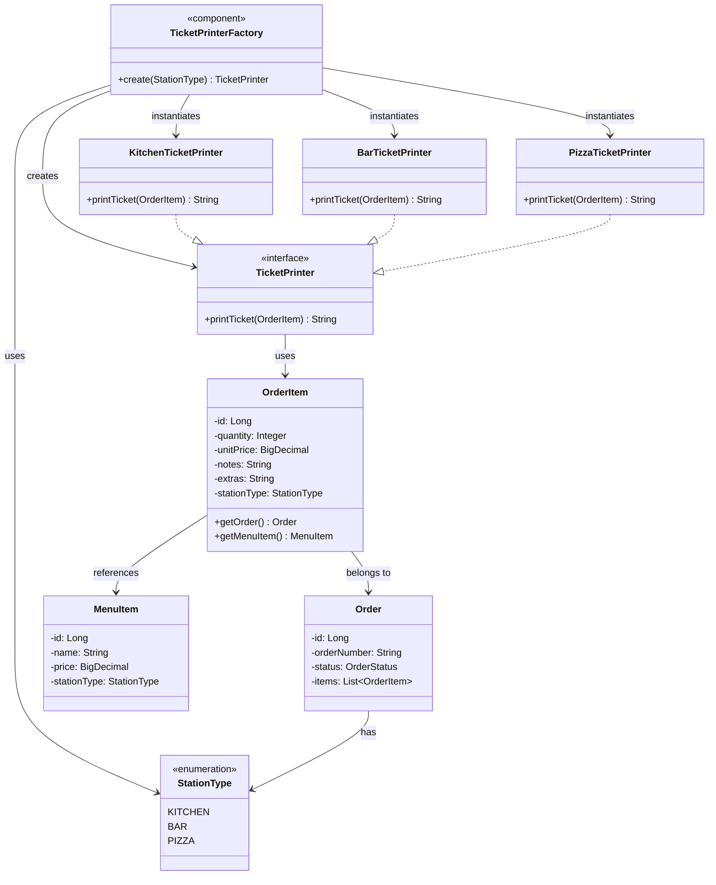
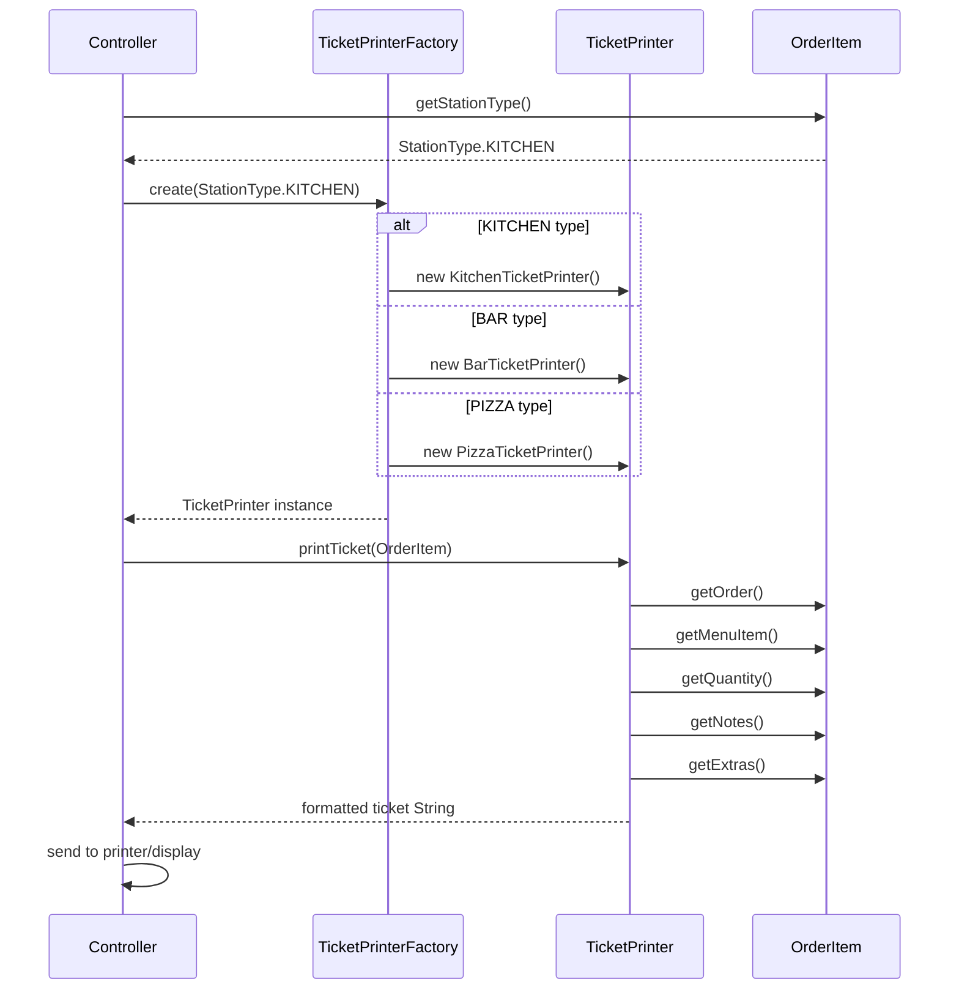

## Flux de execuție Factory Method:



## Comparație: Factory Method vs Abstract Factory

### Factory Method Pattern (TicketPrinterFactory)
```
Responsabilitate: Creează UN singur tip de obiect
Interfață: TicketPrinter
Implementări: KitchenTicketPrinter, BarTicketPrinter, PizzaTicketPrinter
Parametru: StationType enum
Avantaj: Decuplare client de clasele concrete
```

### Abstract Factory Pattern (RestaurantModeFactory)
```
Responsabilitate: Creează FAMILII de obiecte corelate
Interfețe: OrderFormConfig + ReceiptConfig
Implementări: Standard mode, Banquet mode
Avantaj: Coeziune puternică între produsele din aceeași familie
```

