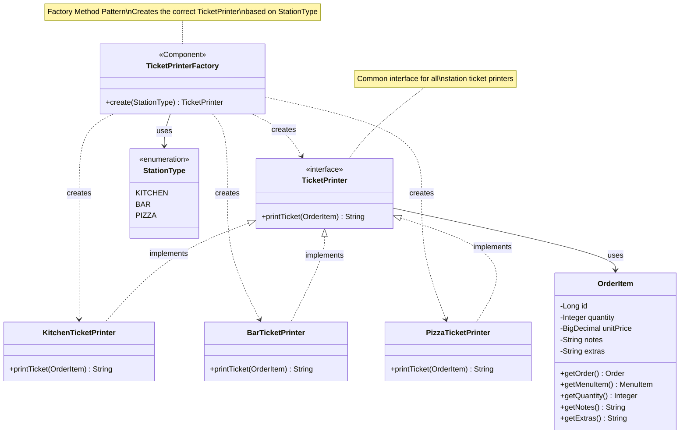

```mermaid
classDiagram
    class TicketPrinter {
        <<interface>>
        +printTicket(OrderItem) String
    }
    
    class TicketPrinterFactory {
        <<Component>>
        +create(StationType) TicketPrinter
    }
    
    class KitchenTicketPrinter {
        +printTicket(OrderItem) String
    }
    
    class BarTicketPrinter {
        +printTicket(OrderItem) String
    }
    
    class PizzaTicketPrinter {
        +printTicket(OrderItem) String
    }
    
    class StationType {
        <<enumeration>>
        KITCHEN
        BAR
        PIZZA
    }
    
    class OrderItem {
        -Long id
        -Integer quantity
        -BigDecimal unitPrice
        -String notes
        -String extras
        +getOrder() Order
        +getMenuItem() MenuItem
        +getQuantity() Integer
        +getNotes() String
        +getExtras() String
    }
    
    TicketPrinter <|.. KitchenTicketPrinter : implements
    TicketPrinter <|.. BarTicketPrinter : implements
    TicketPrinter <|.. PizzaTicketPrinter : implements
    
    TicketPrinterFactory ..> TicketPrinter : creates
    TicketPrinterFactory ..> KitchenTicketPrinter : creates
    TicketPrinterFactory ..> BarTicketPrinter : creates
    TicketPrinterFactory ..> PizzaTicketPrinter : creates
    
    TicketPrinterFactory --> StationType : uses
    
    TicketPrinter --> OrderItem : uses
    
    note for TicketPrinterFactory "Factory Method Pattern\nCreates the correct TicketPrinter\nbased on StationType"
    
    note for TicketPrinter "Common interface for all\nstation ticket printers"
```

